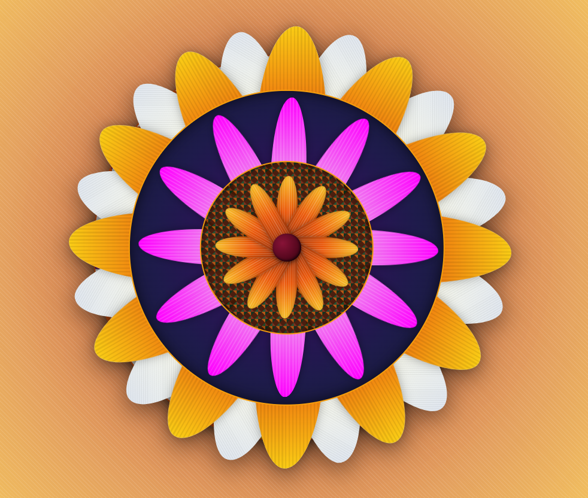

# 🌸 Code-a-Pookalam


A traditional Kerala **Pookalam recreated using code** with HTML, CSS, and JavaScript. 🌼

The design uses layered circular elements, CSS gradients, dynamically generated petals, and JavaScript-based rotation to create a symmetrical floral pattern inspired by traditional Onam Pookalam designs.

## 🌼 Pookalam Preview



## 🛠️ Technologies Used

- **HTML** – Structure of the Pookalam
- **CSS** – Styling, gradients, colors, shapes, layering, and visual effects
- **JavaScript** – Dynamic generation and rotation of petals

## ✨ Features

- 🌸 Traditional Pookalam-inspired floral design
- 🔄 Radial symmetry using dynamically rotated petals
- 🎨 Multiple CSS gradients for flower and background patterns
- 🌼 Multiple layers of petals and circular elements
- 💻 Petals generated dynamically using JavaScript
- 🖼️ Layered design using CSS positioning and `z-index`
- ✨ CSS shadows and visual effects
- 📱 Responsive layout structure

## ⚙️ How It Works

### HTML

HTML provides the basic structure of the Pookalam, including:

- Flower container
- Petal containers
- Inner and outer circles
- Flower center

### CSS

CSS is used to create the visual design using:

- `radial-gradient()`
- `linear-gradient()`
- `repeating-linear-gradient()`
- `repeating-conic-gradient()`
- `border-radius`
- `Absolute positioning`
- `transform`
- `z-index`
- Drop shadows

### JavaScript

JavaScript dynamically creates and positions the petals.

The design uses **12 petals** for the primary layers:

```javascript
const numberOfPetals = 12;
const angle = 360 / numberOfPetals;