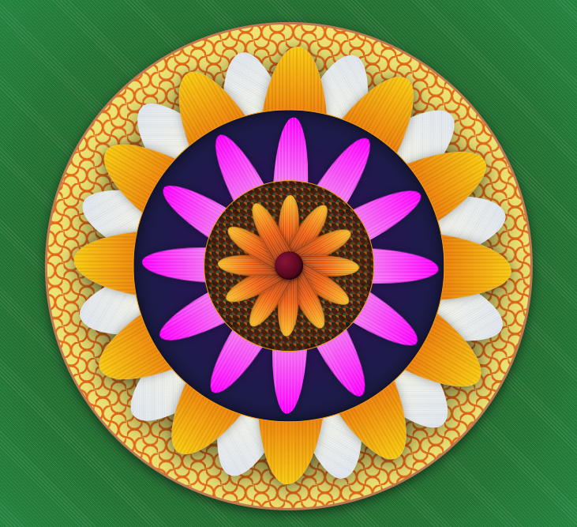

# 🌸 Code-a-Pookalam

A traditional Kerala **Pookalam recreated using code** with HTML, CSS, and JavaScript. 🌼

The design uses layered circular elements, CSS gradients, dynamically generated petals, and JavaScript-based rotation to create a symmetrical floral pattern inspired by traditional Onam Pookalam designs.

## 🌼 Pookalam Preview

## 🛠️ Technologies Used

- **HTML** – Structure of the Pookalam
- **CSS** – Styling, gradients, colors, shapes, layering, and visual effects
- **JavaScript** – Dynamic generation and rotation of petals

## ✨ Features

- 🌸 Traditional Pookalam-inspired floral design
- 🔄 Radial symmetry using dynamically rotated petals
- 🎨 Multiple CSS gradients for flowers and background patterns
- 🌼 Multiple layers of petals and circular elements
- 💻 Petals generated dynamically using JavaScript
- 🖼️ Layered design using CSS positioning and `z-index`
- ✨ CSS shadows and visual effects
- 📱 Responsive layout

## ⚙️ How It Works

### HTML

HTML provides the basic structure of the Pookalam, including:

- Flower container
- Petal containers
- Inner and outer circles
- Flower center

### CSS

CSS is used to create the visual design using:

- `radial-gradient()`
- `linear-gradient()`
- `repeating-linear-gradient()`
- `repeating-conic-gradient()`
- `border-radius`
- Absolute positioning
- `transform`
- `z-index`
- Drop shadows
- Responsive sizing

### JavaScript

JavaScript dynamically creates and positions the petals.

The design uses **12 petals** for the primary layers:

const numberOfPetals = 12;

const angle = 360 / numberOfPetals;

for (let i = 0; i < numberOfPetals; i++) {
}

## Live Demo: https://codeatpookalam.netlify.app/
## 🌸 Conclusion

This project was a small attempt to bring together **tradition and technology** by recreating a Kerala Pookalam through code.

It helped me explore how HTML, CSS, and JavaScript can be used not only to build websites, but also to express creativity and recreate real-world designs digitally.

Every layer, petal, gradient, and rotation was built with code, making this project both a learning experience and a celebration of Onam. 🌼

**A little bit of tradition, a little bit of code, and a lot of creativity. 💻🌸**

---

### 🌼 Made with HTML, CSS & JavaScript

**Code the flowers. Celebrate the tradition. 🌸**
